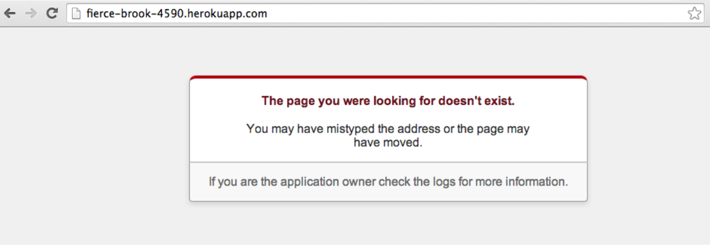
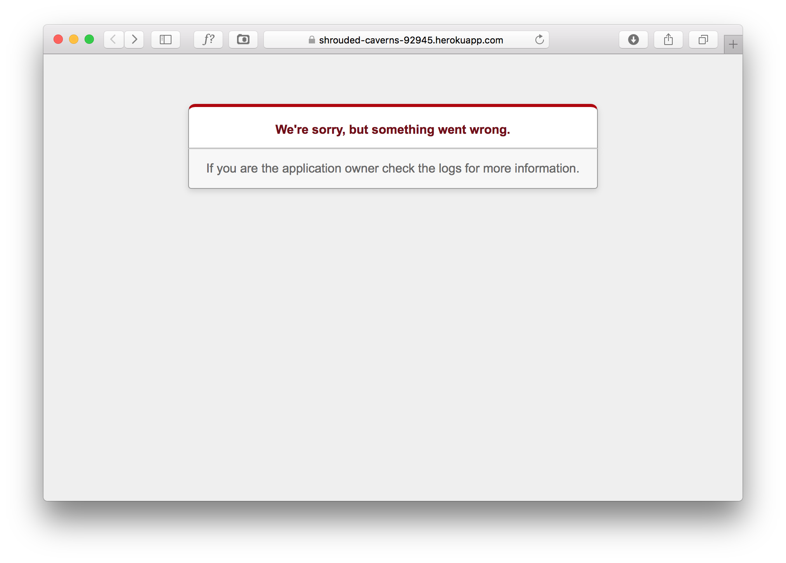
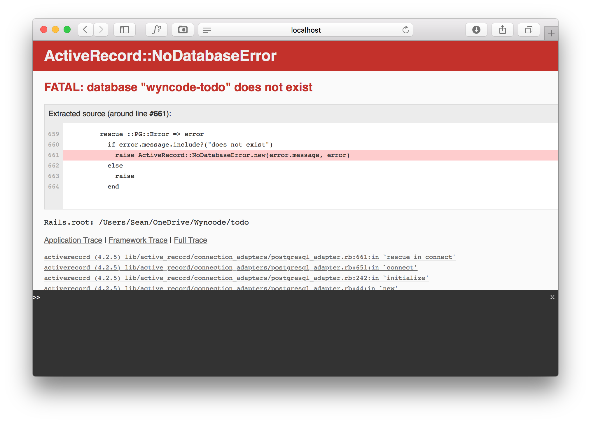
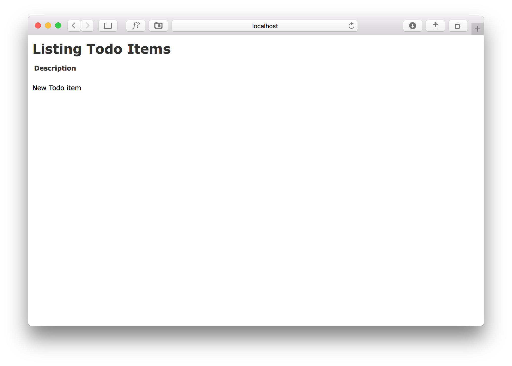
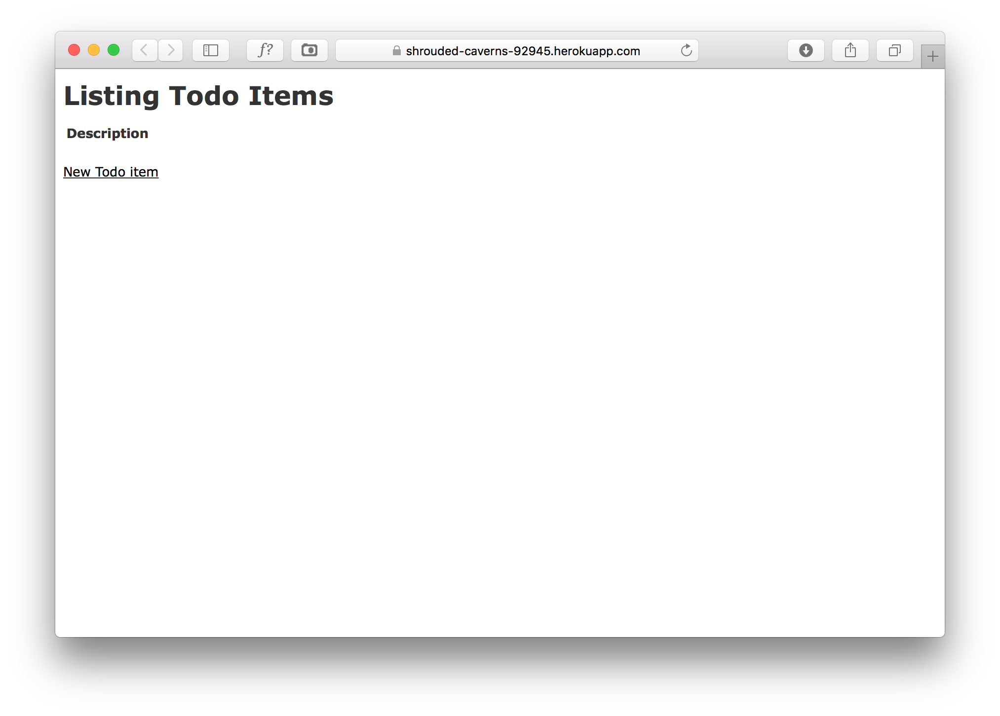

# Deploying A Rails App to Heroku

Let's start with the ToDo app we built in the Scaffolding lecture. Ideally, these steps can be followed on any existing Rails app to get it ready to deploy to Heroku. 

In case you haven't already, let’s initialize and setup Git.

## Setup Git
Initialize Git in the Rails application's directory:

```sh
# In Terminal
$ git init
# Outputs:
Initialized empty Git repository in /Users/etoro/src/models2/.git/
```

Stage your changes for commit:
```sh
# In Terminal
$ git add .
```

Check status to see which files are staged:
```sh
# In Terminal
$ git status

# Outputs: 
On branch master

Initial commit

Changes to be committed:
  (use "git rm --cached <file>..." to unstage)

  new file:   .gitignore
  new file:   Gemfile
  new file:   Gemfile.lock
  new file:   README.rdoc
  new file:   Rakefile
  new file:   app/assets/images/.keep
  new file:   app/assets/javascripts/application.js
  new file:   app/assets/stylesheets/application.css
  new file:   app/controllers/application_controller.rb
  new file:   app/controllers/concerns/.keep
  new file:   app/helpers/application_helper.rb
  new file:   app/mailers/.keep
  new file:   app/models/.keep
  new file:   app/models/concerns/.keep
  new file:   app/views/layouts/application.html.erb
  new file:   bin/bundle
  new file:   bin/rails
  new file:   bin/rake
  new file:   config.ru
  new file:   config/application.rb
  new file:   config/boot.rb
  new file:   config/database.yml
  new file:   config/environment.rb
  new file:   config/environments/development.rb
  new file:   config/environments/production.rb
  new file:   config/environments/test.rb
  new file:   config/initializers/backtrace_silencers.rb
  new file:   config/initializers/cookies_serializer.rb
  new file:   config/initializers/filter_parameter_logging.rb
  new file:   config/initializers/inflections.rb
  new file:   config/initializers/mime_types.rb
  new file:   config/initializers/session_store.rb
  new file:   config/initializers/wrap_parameters.rb
  new file:   config/locales/en.yml
  new file:   config/routes.rb
  new file:   config/secrets.yml
  new file:   db/seeds.rb
  new file:   lib/assets/.keep
  new file:   lib/tasks/.keep
  new file:   log/.keep
  new file:   public/404.html
  new file:   public/422.html
  new file:   public/500.html
  new file:   public/favicon.ico
  new file:   public/robots.txt
  new file:   test/controllers/.keep
  new file:   test/fixtures/.keep
  new file:   test/helpers/.keep
  new file:   test/integration/.keep
  new file:   test/mailers/.keep
  new file:   test/models/.keep
  new file:   test/test_helper.rb
  new file:   vendor/assets/javascripts/.keep
  new file:   vendor/assets/stylesheets/.keep
```

Make that first commit:

```sh
# In Terminal
$ git commit -m "initial Rails commit"
# Outputs:
[master (root-commit) 2c46fd5] initial Rails commit
 54 files changed, 875 insertions(+)
 create mode 100644 .gitignore
 create mode 100644 Gemfile
 create mode 100644 Gemfile.lock
 create mode 100644 README.rdoc
 create mode 100644 Rakefile
 create mode 100644 app/assets/images/.keep
 create mode 100644 app/assets/javascripts/application.js
 create mode 100644 app/assets/stylesheets/application.css
 create mode 100644 app/controllers/application_controller.rb
 create mode 100644 app/controllers/concerns/.keep
 create mode 100644 app/helpers/application_helper.rb
 create mode 100644 app/mailers/.keep
 create mode 100644 app/models/.keep
 create mode 100644 app/models/concerns/.keep
 create mode 100644 app/views/layouts/application.html.erb
 create mode 100755 bin/bundle
 create mode 100755 bin/rails
 create mode 100755 bin/rake
 create mode 100644 config.ru
 create mode 100644 config/application.rb
 create mode 100644 config/boot.rb
 create mode 100644 config/database.yml
 create mode 100644 config/environment.rb
 create mode 100644 config/environments/development.rb
 create mode 100644 config/environments/production.rb
 create mode 100644 config/environments/test.rb
 create mode 100644 config/initializers/backtrace_silencers.rb
 create mode 100644 config/initializers/cookies_serializer.rb
 create mode 100644 config/initializers/filter_parameter_logging.rb
 create mode 100644 config/initializers/inflections.rb
 create mode 100644 config/initializers/mime_types.rb
 create mode 100644 config/initializers/session_store.rb
 create mode 100644 config/initializers/wrap_parameters.rb
 create mode 100644 config/locales/en.yml
 create mode 100644 config/routes.rb
 create mode 100644 config/secrets.yml
 create mode 100644 db/seeds.rb
 create mode 100644 lib/assets/.keep
 create mode 100644 lib/tasks/.keep
 create mode 100644 log/.keep
 create mode 100644 public/404.html
 create mode 100644 public/422.html
 create mode 100644 public/500.html
 create mode 100644 public/favicon.ico
 create mode 100644 public/robots.txt
 create mode 100644 test/controllers/.keep
 create mode 100644 test/fixtures/.keep
 create mode 100644 test/helpers/.keep
 create mode 100644 test/integration/.keep
 create mode 100644 test/mailers/.keep
 create mode 100644 test/models/.keep
 create mode 100644 test/test_helper.rb
 create mode 100644 vendor/assets/javascripts/.keep
 create mode 100644 vendor/assets/stylesheets/.keep
```

Quickly check your status again to see that everything was committed successfully:

```sh
# In Terminal
$ git status

# Outputs:
On branch master
nothing to commit, working directory clean
```


Almost all Rails apps start this way. The first Git commit is usually an empty Rails template.


## Setting Up Heroku

Now let’s setup Heroku.

```sh
# In Terminal
$ heroku create

# Outputs:
Creating fierce-brook-4590... done, stack is cedar
http://fierce-brook-4590.herokuapp.com/ | git@heroku.com:fierce-brook-4590.git
Git remote heroku added
```

In previous lectures, to deploy to Heroku we needed to create a Gemfile and a Procfile. Now that we’re on Rails, we can skip the Procfile. And a Gemfile was generated automatically for us. We just need to update it.

In the Gemfile, find this line:

```ruby
# In Gemfile

# Use sqlite3 as the database for Active Record
gem 'sqlite3'
```
and replace it with these lines:

```ruby
# In Gemfile

# Use sqlite3 as the database for Active Record in Development
group :development do
  gem 'sqlite3'
end
# Use postgreSQL as the database for Active Record in Production
group :production do
  gem 'pg'
end
```

We’ll explain what “development” and “production” mean in a few minutes. What this change does is define two blocks in our Gemfile. One lists gems that apply to “development” (our laptop) and another lists gems that apply to “production” (in Heroku). Heroku requires the “pg” gem because it only knows how to run the Postgres database.

Despite only being required for Heroku, bundler will attempt to install the “pg” gem on your laptop. Unfortunately, it may not be able to.

We asked you to install Postgres.app in the pre-work. Today is the day we actually use it. But not just yet. Instead, we need to let the `gem` command know where Postgres is hiding.

```sh
# In Terminal
$ gem install pg -- --with-pg-config=/Applications/Postgres.app/Contents/Versions/9.4/bin/pg_config

# Outputs:
Building native extensions with: '--with-pg-config=/Applications/Postgres.app/Contents/Versions/9.4/bin/pg_config'
This could take a while...
Successfully installed pg-0.17.1
1 gem installed
```

(You may need to type this out yourself if copy+paste doesn’t work. Some students have had trouble with the “--” characters in particular.)

After we installed the “pg” gem separately, bundler will skip over it when we re-bundle our app.

Do you remember why we need to use a Gemfile with Heroku? We talked about it in the Ruby Servers lecture.

Heroku uses the Gemfile to find and install the gems we need in our environment.

Go ahead and run bundle install again to make sure everything's all set:

```shell
# In Terminal
$ bundle install

# Outputs:
Resolving dependencies...
Using rake 10.3.2
Using i18n 0.6.9
Using json 1.8.1
Using minitest 5.3.4
Using thread_safe 0.3.4
Using tzinfo 1.2.1
Using activesupport 4.1.1
Using builder 3.2.2
Using erubis 2.7.0
Using actionview 4.1.1
Using rack 1.5.2
Using rack-test 0.6.2
Using actionpack 4.1.1
Using mime-types 1.25.1
Using polyglot 0.3.5
Using treetop 1.4.15
Using mail 2.5.4
Using actionmailer 4.1.1
Using activemodel 4.1.1
Using arel 5.0.1.20140414130214
Using activerecord 4.1.1
Using bundler 1.6.2
Using coffee-script-source 1.7.0
Using execjs 2.1.0
Using coffee-script 2.2.0
Using thor 0.19.1
Using railties 4.1.1
Using coffee-rails 4.0.1
Using hike 1.2.3
Using multi_json 1.10.1
Using jbuilder 2.0.7
Using jquery-rails 3.1.0
Using pg 0.17.1
Using tilt 1.4.1
Using sprockets 2.11.0
Using sprockets-rails 2.1.3
Using rails 4.1.1
Using rdoc 4.1.1
Using sass 3.2.19
Using sass-rails 4.0.3
Using sdoc 0.4.0
Using spring 1.1.3
Using sqlite3 1.3.9
Using turbolinks 2.2.2
Using uglifier 2.5.0
Your bundle is complete!
Use `bundle show [gemname]` to see where a bundled gem is installed.

bundle was successful. Let’s check our git status.
```

Run `git status` to see what changes have occured:

```sh
# In Terminal
$ git status
On branch master
Changes not staged for commit:
  (use "git add <file>..." to update what will be committed)
  (use "git checkout -- <file>..." to discard changes in working directory)

  modified:   Gemfile
  modified:   Gemfile.lock
```

We updated our Gemfile, so it makes sense that Git detects it as modified.

And when we ran bundle install, bundler updated Gemfile.lock. Do you remember why? 

The Gemfile only tells Heroku which gems to install. Gemfile.lock tells Heroku which versions of each gem to install, which is important. If a gem is updated, you don’t want to automatically include those updates in your Heroku site. You want to test them first to see if the updates break anything.

So both of these modifications look right. Let’s commit.

```shell
# In Terminal
$ git add .
$ git commit -m "Gemfile updates"

# Outpus
[master 841bee5] Gemfile updates
 2 files changed, 14 insertions(+), 2 deletions(-)
 ```

 Check the status again:

 ```sh
 # In Terminal
$ git status

# Outputs:
On branch master
nothing to commit, working directory clean
```

Git is clean. Let’s push to Heroku.

```sh
# In Terminal:
$ git push heroku master

# Outputs:
Initializing repository, done.
Counting objects: 65, done.
Delta compression using up to 4 threads.
Compressing objects: 100% (54/54), done.
Writing objects: 100% (65/65), 15.21 KiB | 0 bytes/s, done.
Total 65 (delta 5), reused 0 (delta 0)

-----> Ruby app detected
-----> Compiling Ruby/Rails
-----> Using Ruby version: ruby-2.0.0
-----> Installing dependencies using 1.5.2
       Running: bundle install --without development:test --path vendor/bundle --binstubs vendor/bundle/bin -j4 --deployment
       Fetching gem metadata from https://rubygems.org/..........
       Fetching additional metadata from https://rubygems.org/..
       Installing minitest (5.3.4)
       Installing i18n (0.6.9)
       Installing rake (10.3.2)
       Installing thread_safe (0.3.4)
       Installing builder (3.2.2)
       Installing erubis (2.7.0)
       Installing mime-types (1.25.1)
       Installing rack (1.5.2)
       Installing polyglot (0.3.5)
       Installing execjs (2.1.0)
       Installing arel (5.0.1.20140414130214)
       Installing coffee-script-source (1.7.0)
       Installing hike (1.2.3)
       Installing multi_json (1.10.1)
       Using bundler (1.5.2)
       Installing thor (0.19.1)
       Installing tilt (1.4.1)
       Installing sass (3.2.19)
       Installing rack-test (0.6.2)
       Installing tzinfo (1.2.1)
       Installing treetop (1.4.15)
       Installing coffee-script (2.2.0)
       Installing sprockets (2.11.0)
       Installing mail (2.5.4)
       Installing json (1.8.1)
       Installing uglifier (2.5.0)
       Installing activesupport (4.1.1)
       Installing rdoc (4.1.1)
       Installing jbuilder (2.0.7)
       Installing activemodel (4.1.1)
       Installing actionview (4.1.1)
       Installing sdoc (0.4.0)
       Installing actionpack (4.1.1)
       Installing activerecord (4.1.1)
       Installing sprockets-rails (2.1.3)
       Installing actionmailer (4.1.1)
       Installing railties (4.1.1)
       Installing coffee-rails (4.0.1)
       Installing jquery-rails (3.1.0)
       Installing turbolinks (2.2.2)
       Installing rails (4.1.1)
       Installing sass-rails (4.0.3)
       Installing pg (0.17.1)
       Your bundle is complete!
       Gems in the groups development and test were not installed.
       It was installed into ./vendor/bundle
       Post-install message from rdoc:
       Depending on your version of ruby, you may need to install ruby rdoc/ri data:
       <= 1.8.6 : unsupported
       = 1.8.7 : gem install rdoc-data; rdoc-data --install
       = 1.9.1 : gem install rdoc-data; rdoc-data --install
       >= 1.9.2 : nothing to do! Yay!
       Bundle completed (29.13s)
       Cleaning up the bundler cache.
-----> Preparing app for Rails asset pipeline
       Running: rake assets:precompile
       I, [2014-06-04T22:24:15.113661 #1069]  INFO -- : Writing /tmp/build_c145a1b1-6d4f-414c-b5c0-6452d6422bc1/public/assets/application-59ffd4525232837e51088483ed301f44.js
       I, [2014-06-04T22:24:15.139517 #1069]  INFO -- : Writing /tmp/build_c145a1b1-6d4f-414c-b5c0-6452d6422bc1/public/assets/application-9cc0575249625b8d8648563841072913.css
       Asset precompilation completed (6.91s)
       Cleaning assets
       Running: rake assets:clean
-----> WARNINGS:
       Include 'rails_12factor' gem to enable all platform features
       See https://devcenter.heroku.com/articles/rails-integration-gems for more information.
       
       You have not declared a Ruby version in your Gemfile.
       To set your Ruby version add this line to your Gemfile:
       ruby '2.0.0'
       # See https://devcenter.heroku.com/articles/ruby-versions for more information.
       
       No Procfile detected, using the default web server (webrick)
       https://devcenter.heroku.com/articles/ruby-default-web-server
-----> Discovering process types
       Procfile declares types -> (none)
       Default types for Ruby  -> console, rake, web, worker

-----> Compressing... done, 21.2MB
-----> Launching... done, v6
       http://fierce-brook-4590.herokuapp.com/ deployed to Heroku

To git@heroku.com:fierce-brook-4590.git
 * [new branch]      master -> master
```

That looks good. Heroku assigned me a URL (in last line after `Compressing... Launching..`, right before `deployed to Heroku`). So let’s run that in a browser and see what happens.



# Setup Rails Homepage

Well that doesn’t look good. What’s going on? Let’s use the curl command to investigate.

```shell
# In Terminal
$ curl -iX HEAD http://fierce-brook-4590.herokuapp.com

# Outputs:
HTTP/1.1 404 Not Found 
Content-length: 1564
Content-Type: text/html; charset=utf-8
Date: Wed, 04 Jun 2014 22:31:37 GMT
Server: WEBrick/1.3.1 (Ruby/2.0.0/2014-05-08)
X-Request-Id: 54df9652-833f-4818-a7a1-5bcd4c92feb9
X-Runtime: 0.005302
Connection: keep-alive
```

So there’s good news and bad news. Good news: the server is running. Bad news: the homepage is returning a 404 (Not Found). Heroku can’t find my homepage.

But I do have a homepage. I just saw it running at `http://localhost:3000/`. So what’s wrong?

The answer is hinted at in this section of Gemfile.

```ruby
# In Gemfile
group :development do
  gem 'sqlite3'
end

group :production do
  gem 'pg'
end
```

These config files are also a hint.

```sh
# In Terminal
$ ls config/environments/

# Outputs:
development.rb  production.rb test.rb
```

What do “development”, “production”, and “test” mean? Rails recognizes 3 different server environments:

**Development environment:** where the coding happens
**Production environment:** where the deployment happens
**Test environment:** where the testing happens

On your laptop, Rails defaults to the development environment. On Heroku, it defaults to the production environment. 

The dev environment displays the default Rails homepage if there's no homepage defined. The production environment doesn’t. 

First things first. Before we start digging deeper, let’s get something working on Heroku, just to confirm that the app is ok.

Since Rails doesn’t show the welcome page in the prod env, let’s make the index page of our ToDo app the homepage.

We want `TodoController` to load from the “root” of our application. Do you remember what that means from the Ruby Web Servers homework?

All of the Rails configuration files are stored in the config directory.

```sh
# In Terminal
$ ls config

# Outputs:
application.rb  boot.rb   database.yml  environment.rb  environments  initializers  locales   routes.rb secrets.yml
```

Just like in Sinatra, we need to define a “route” from “/” to the HomeController. Those routes go in `config/routes.rb`.

```ruby
# In config/routes.rb
Rails.application.routes.draw do
  root 'todo_items#index'
  resources :todo_items
  # a bunch of comments describing how to define routes
end
```

`routes.rb` defines all the routes in our application. The “root” method maps “/” (the root route) to a controller and action. In this case, the action name is arbitrary - “index” usually refers to the default action in a controller.

Now that the route is defined, let’s see what happens to our homepage. 

```ruby
# In Terminal
rails s
```

Visit `http://localhost:3000/`. The default Rails homepage is gone, now we go straight to our todo items index page! 

Great, we’ve got a homepage. Let’s commit and deploy to Heroku and move on.

```sh
# In Terminal
$ git add .
$ git commit -m "new homepage"
$ git push heroku master
```

Website complete. Now we can go home.



Not so fast!


# Configure Database

Our database needs to be configured for Heroku. There's no helpful errors here like we get in our development environment. You just have to be on top of all these database things as you develop your app and push to heroku.

The default database connection information is stored in a Rails configuration file.

```ruby
# In config/database.yml

# SQLite version 3.x
#   gem install sqlite3
#
#   Ensure the SQLite 3 gem is defined in your Gemfile
#   gem 'sqlite3'
#
default: &default
  adapter: sqlite3
  pool: 5
  timeout: 5000

development:
  <<: *default
  database: db/development.sqlite3

# Warning: The database defined as "test" will be erased and
# re-generated from your development database when you run "rake".
# Do not set this db to the same as development or production.
test:
  <<: *default
  database: db/test.sqlite3

production:
  <<: *default
  database: db/production.sqlite3
```

This file is written in YaML (“Yet Another Markup Language”, later renamed to “YAML Ain't Markup Language”). Like HTML and XML, YaML is a markup language, but it’s a bit more user friendly. Think of it kinda like a big Hash (or JavaScript object literal). In was first released in 2001 by some-guys-whose-names-I-won’t-remember-anyway-so-why-bother-mentioning-them.

This database.yml contains all the information ActiveRecord needs to know to establish a connection for us. Currently, it's configured to use `sqlite3` as it's adapter. 


We’re not going to use SQLite3 today. We’re going to use PostgreSQL. That’s what Heroku uses, so I might as well try to achieve “dev/prod parity” (http://12factor.net/dev-prod-parity). That means I want to make every effort to make sure that my “development” environment matches my “production” environment. I want to minimize the likelihood of finding a bug on my server that I can’t replicate on my laptop (and vice versa).

(BTW, that implies that if you’re deploying to a Unix-based server, you should be using a Unix-based laptop. Sorry Windows.)

Anyway, let’s startup the Postgres app.

On Mac, that’s pretty much all I need to do to get Postgres running locally. Just start the app. A little icon appears in my header bar. I can close out this window and Postgres will still be running.

The beauty of ActiveRecord is we can update this configuration and suddenly our app is using a whole other database flavor without rewriting any code.

```ruby
# In config/database.yml

default: &default
  adapter: postgresql
  pool: 5
  timeout: 5000

development:
  <<: *default
  #database: db/development.sqlite3
  database: wyncode-todo

# Warning: The database defined as "test" will be erased and
# re-generated from your development database when you run "rake".
# Do not set this db to the same as development or production.
test:
  <<: *default
  database: wyncode-todo-test
```


The adapter is “postgresql” (corresponding to the “pg” gem). The host can be undefined. On Mac the username is my Mac username. (On Ubuntu it’s probably root or postgres.) I’ll keep the database name the same in the “dev” block to keep things simple. In the test block I’ll change the database name to wyncode-test.

Since my “dev” and “prd” environments match, I can simplify my Gemfile as well.

```ruby
# In Gemfile

# Use sqlite3 as the database for Active Record
#group :development do
#  gem 'mysql2'
#end
#
#group :production do
#  gem 'pg'
#end

# Use postgres as the database for Active Record
gem 'pg'
```

Let’s try it out. Launch your server with `rails s` and visit `http://localhost:3000`.




Why does the database not exist? When you create a new Rails app, it automatically creates sqlite (file-based “fake”) databases for you, one for each environment.

```sh
# In Terminal:
$ ls db/*.sqlite3

# Outputs:
db/development.sqlite3  db/production.sqlite3 db/test.sqlite3
```

This time around we’re starting with a brand new Postgres database. Nothing was setup ahead of time. So we need to run some rake tasks to set it up.

```sh
# In Terminal:
$ rake db:create db:migrate

# Outputs:
== 20140605210634 CreateUsers: migrating ======================================
-- create_table(:todo_items)
   -> 0.0050s
== 20140605210634 CreateTodoItems: migrated (0.0051s) =============================
```

That looks like it works. It also demonstrates the ability to specify multiple tasks in one rake command. The tasks are run in order, from left to right.

The `db:create` command will create the “wyncode” database for us.
The `db:migrate` command will create the "todo_items" table and columns for us.

Let’s try it out now.



Everything works! We've switched our database adapter to Postgres, and ran `rake db:create` & `db:migrate` commands to setup our new postgres databases. What’s next?

Let’s commit and push to Heroku. Heroku uses Postgres, so it should work there as well.

```sh
# In Terminal:
$ git status

# Outputs
On branch master
Changes not staged for commit:
  (use "git add <file>..." to update what will be committed)
  (use "git checkout -- <file>..." to discard changes in working directory)

  modified:   Gemfile
  modified:   Gemfile.lock
  modified:   config/database.yml
  modified:   db/schema.rb
```


Git detected the changes we made to Gemfile and database.yml, along with some others. Let’s add all this and commit.

```shell
# In Terminal:
$ git add .
$ git commit -m "add user model, switch to postgres in dev"
$ git push heroku master
```

When I refresh my Heroku site, nothing changes. I changed the database to use Postgres, like Heroku needs, but I'm still getting the same error.

Oops! I need to run the rake tasks in production. I don’t need to run `db:create` because Heroku does that for me automatically. **But I need to run `rake db:migrate` after pushing to heroku.**

I can run any terminal command on Heroku, all I need to do is prepend `heroku run`, and it will run that command in the production environment.

```ruby
# In Terminal
$ heroku run rake db:migrate

# Outputs:
Running `rake db:migrate` attached to terminal... up, run.2768
== 20140605210634 CreateUsers: migrating ======================================
-- create_table(:todo_items)
   -> 0.0235s
== 20140605210634 CreateTodoItems: migrated (0.0295s) =============================
```
Now let’s try refreshing that page. If you closed it, you can always run `heroku open` to visit the page in your browser.



 Heroku is ready to go! ...almost. Before we make the last change necessary for things to run smoothly on heroku, let's take a quick detour to talk about Rake.

### Detour: Rake

What are these `rake` commands we ran?

In 1976, computer programmer Stuart Feldman created Make, a program for running and managing simple tasks. As you’re building a large application, you may sometimes find it necessary to accomplish some small one-off tasks. For example, you may need to setup a database. Perhaps you need to install a gem. Maybe you can’t build the database until you install the gem, so those tasks depend on each other. Make handles those tasks. 

Make tasks are things you don’t need to do every day. They don’t need run every time you start the server. But they’re nice to have for those special moments.

Rake is a Ruby implementation of Make written by Jim Weirich in 2004. Jim passed away in February of this year and his final GitHub commit was turned into a public memorial. The rake gem he created was so useful that it has been packaged with Ruby since v1.9. You get rake for free when you install Ruby.

When you use rake from the command line, it reads a file in the same directory named Rakefile. This file defines all the different tasks you can run with rake.

```ruby
# In Rakefile
# Add your own tasks in files placed in lib/tasks ending in .rake,
# for example lib/tasks/capistrano.rake, and they will automatically be available to Rake.

require File.expand_path('../config/application', __FILE__)

Rails.application.load_tasks
```

The default Rails Rakefile is sparse. Most of the tasks are loaded by a method inside Rails. There are useful instructions in this file for how to define your own Rake tasks, if you’re ever so inclined.

If you’d like to see a list of all the available rake tasks (along with descriptions), use `rake -T`.

```sh
# In Terminal
$ rake -T

# Outputs:
rake about                              # List versions of all Rails frameworks and the environment
… stuff ...
rake db:create                          # Creates the database from DATABASE_URL or config/database.yml for the current RAILS_ENV (use db:create:al...
rake db:drop                            # Drops the database from DATABASE_URL or config/database.yml for the current RAILS_ENV (use db:drop:all to...
rake db:fixtures:load                   # Load fixtures into the current environment's database
rake db:migrate                         # Migrate the database (options: VERSION=x, VERBOSE=false, SCOPE=blog)
rake db:migrate:status                  # Display status of migrations
rake db:rollback                        # Rolls the schema back to the previous version (specify steps w/ STEP=n)
# ... more stuff ...
```

# Heroku Static Assets Fix
Gotcha: Heroku handles static assets differently. 

What do we mean by "static assets"? While not noticeable in this example, Heroku isn’t returning our customized CSS and JavaScript. We can’t tell because we haven’t actually written any CSS or JS. But if we did, Heroku would return a 404 (Not Found).

TODO: Demo this failure.

One of the most common Wyncode student complaints we get about Heroku is that your beautiful, well-crafted CSS and brilliantly unobtrusive JavaScript aren’t loading correctly.

If Google or anyone ever tells you to “precompile assets” to fix this problem, that person is wrong. Never do that.

For Heroku to serve your static assets correctly, a configuration change is required. It doesn’t make a difference to us now because we aren’t writing any CSS/JS for this tutorial. But you should get some practice making this change now.

```ruby
# In Gemfile
group :production do
  gem 'rails_12factor'
end
```

Heroku’s [rails_12factor gem](https://github.com/heroku/rails_12factor) makes your web application (more) compliant with the [“twelve-factor” methodology](http://12factor.net/). We won’t get into all 12 factors, but suffice to say that all this gem does is update some Rails configuration values. 

In fact, all this gem does is update two values. And it doesn’t even do the work itself. It just references two other gems, [rails_serve_static_assets](https://github.com/heroku/rails_serve_static_assets) and [rails_stdout_logging](https://github.com/heroku/rails_stdout_logging). Each of those gems updates a single configuration value.

You could easily make those updates yourself, if you’d like. The relevant config values are `config.serve_static_files` and `config.logger` in `config/environments/production.rb`. But we’ll let rails_12factor do it for us.

Note that this gem is inside a `group :production` block.

That means this gem will only apply when the app is run in "production mode". Heroku runs your app in production mode by default. So we only want this gem activated on Heroku.

You can activate `rails_12factor` in every environment if you’d like (put it outside of the `:production` group in your Gemfile). It won’t affect your assets (probably...), but it will cause extra logging to appear. That could be useful or overwhelming, depending on how much you enjoy SQL.

## Conclusion

And that's it! We've successfully deployed a Rails app to Heroku. To recap, we:

1. **Setup Git** (with `git init` followed by a commit.)
2. **Setup Heroku** (with `heroku create` then `git push heroku master`)
3. **Made sure a Homepage was defined** (by defining a `root` path in our routes)
4. **Configured our Database** (switched to postgresql in `config/database.yml`, and ran `rake db:create db:migrate` locally and `heroku run rake db:migrate` after pushing to heroku.)
5. **Configured Rails to serve static assets** (by including `rails_12factor` in our Gemfile's `production` group)

